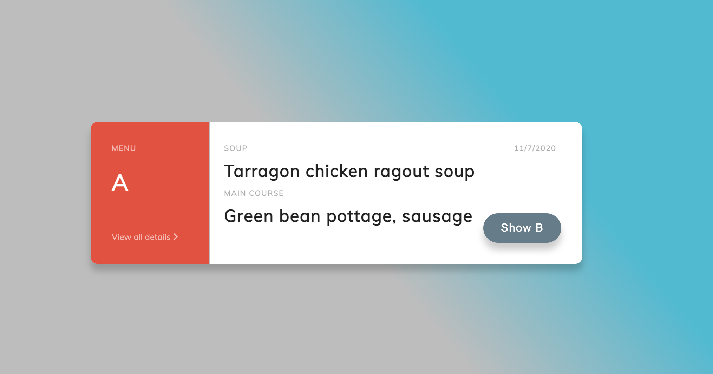
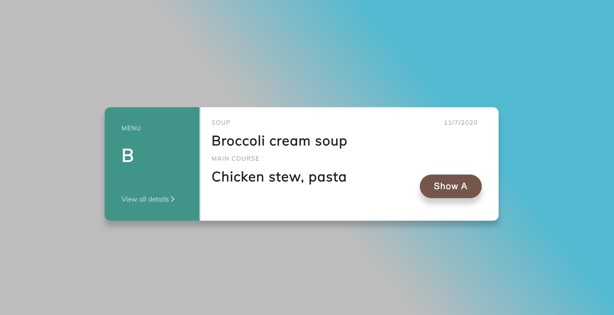
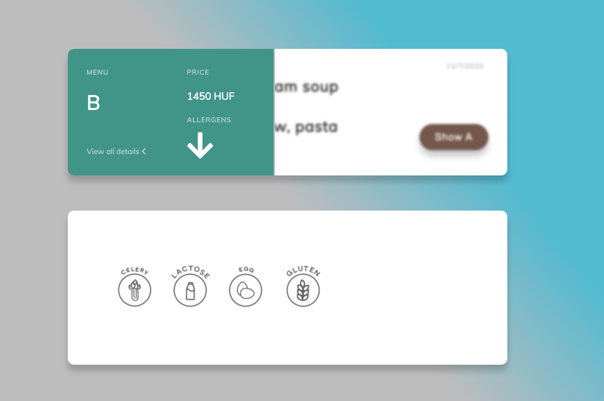

   # Food Fetcher
   
   The task was:
   
  - To implement a server wich is able to somehow grab data from a third party website. 
  - Than parse it to the required format and 
  - display it on a web client written in React JS

#### Table of contents

- [Tech](#tech)
- [Installation](#installation)
  * [Start up in localhost](#method-1-start-up-in-localhost)
  * [The Docker way](#method-2-the-docker-way)
  * [It is deployed on Heroku!](#method-3-it-is-deployed-on-heroku!)
- [ Use the app](#use-the-app)
- [Notes](#notes)
- [Resources](#resources)


 
### Tech
The used technologies are:

* [node.js] - v12.19.0
* [Express] - v4.17.1
* [React.js] - v2.6.11
* [Heroku] - v4.4.1


### Installation

#### Method 1: Start up in localhost

The *foodfetcher* Project folder contains two sub-folders. One is *client* one is *server*. Both has it's own package json.
After cloning the repository:
```sh
$ git clone https://github.com/Skeletor48/foodfetcher.git
```

Enter the sub-folders and install the packages:
*client:*
```sh
$ cd foodfetcher
$ cd client
$ npm i
```
*server:*
```sh
$ cd ..
$ cd server
$ npm i
```

Before you start up the applications, first you have to create a *.env* file based on the *.env.example* file that you find in the root folder of the server app.

```
PORT=use your favourite port (I ve used 7000 this time)
HEROKU_PROXY= I know it is not a good pattern to share this type of info but feel free to use my instance https://blooming-wildwood-53398.herokuapp.com/ 
```

Now you should start the server:

```sh`
$ cd server
$ npm run dev
```

and the client:
`
```sh
$ cd ..
$ cd client
$ npm run start
```

> HINT! If the running client can not communicate with the running server, please check the baseURL in 
> `client/src/api/api.js`. The PORT for AXIOS is set to 7000. It can be anything else, but it has 
> to be the same you provided in the .env file for the server.


#### Method 2: The Docker way

First pull the image from DockerHub:

```sh
$ docker pull skeletor48/food-fetcher-server:latest
```

Now we can run it:

```sh
$ docker run --env-file=.env -p 7000:7000 -d skeletor48/food-fetcher-server:latest
```

> HINT! After the *-p* port parameter the first number is the host's port where we expose our image's port 
> defined in the .env file. So this has to be the same like we have in `client/src/api/api.js`. 

> AAAND ANOTHER HINT! Make sure you provide a valid .env file in a right path. A good workaround to run the command from the same 
> diretory where we have the .env file. Also it is VERY IMPORTANT to note, that in this image I use a HEROKU CORS server instance 
to get the data from the website.

Ok so far I hope everything went fine. Let's get our client up!

```sh
$ docker pull skeletor48/food-fetcher-client:latest
```

```sh
$ docker run -p < your favourite port, I used 8048:8048 > -d skeletor48/food-fetcher-client:latest
```

Fingers crossed... now in your browser on http://localhost:8048/menu-a  or on http://localhost:8048/menu-b  the app should run. 


#### Method 3: It is deployed on Heroku!

The server is running on the address: [server](https://food-fetcher.herokuapp.com/api/menus/a "Food Fetcher Server"))
And you can check the working client here: [Client](https://immense-hollows-87899.herokuapp.com/menu-a "Food Fetcher Client")


### Use the app


The app has basically two sites as it was requested by the task.
However they are totally the same.
Hence I guess it would be much more convinient to use only one route, one component and less code. 
My feelings are the same about the two separated APIs on server side.

-

 

 

 

 The so called interface is pretty easy. We have two buttons. 
 One is expands the modal like menu card and the other 
 is routes to the other page aka. to the other menu card.


### Notes

- The app is inrcedibly slow, I had to decide if I show the items hanging in the air empty or hide them till the data arrives. 
I've choosed the second option. I will definelatly take my time to improve the overall performance. At this stage it send a request almost on every rerouting, 
- Both on client and server side it could be more simple with less code
- There is no proper error handling in the project, also a good logger class would be great to implement
- I have to mention the obvious fact that I did not implement any tests. :sweat: I am truly ashamed.
- During the contanerization process I made some mistakes, but I rather left them in working state (runs in development mode, hardcoded url...)


### Resources


| Topic | Link |
| ------ | ------ |
| The node server structure based on this article mas o menos | [https://softwareontheroad.com/ideal-nodejs-project-structure/]|
| This tutoprial was a big help with REST API and Express | [https://dev.to/beznet/build-a-rest-api-with-node-express-mongodb-4ho4?utm_source=additional_box&utm_medium=internal&utm_campaign=regular&booster_org=]|
| For the client I deeply related on this article | [https://www.valentinog.com/blog/redux/]|


[node.js]: <http://nodejs.org>
[express]: <http://expressjs.com>
[React.js]: <https://reactjs.org/>
[Heroku]: <https://www.heroku.com/>